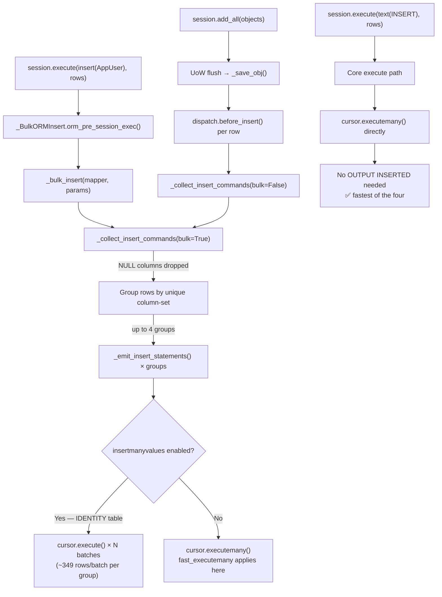

# SQLAlchemy Bulk Insert Performance Analysis — SQL Server / pyodbc

> **Test environment:** SQLAlchemy ≥ 2.0.49, pyodbc ≥ 5.3.0, ODBC Driver 18 for SQL Server,
> 500,000 rows, `dbo.AppUser` table with an IDENTITY primary key.

## Executive Summary

The counter-intuitive timings stem from three compounding issues:

1. **`insertmanyvalues` is the dominant execution path.** SQLAlchemy 2.0's `insertmanyvalues`
   feature (on by default for MSSQL) rewrites every ORM INSERT into multi-row
   `VALUES(…),(…),…` batches with `OUTPUT INSERTED` to retrieve IDENTITY PKs. This is
   generally fast, but when rows have `NULL` values in optional columns they get
   **fragmented into many smaller batches**, sharply increasing round-trips.

2. **`fast_executemany` is silently bypassed for all ORM inserts.** Because `AppUser` has
   `autoincrement=True` (an IDENTITY column), SQLAlchemy always uses `insertmanyvalues`
   (calling `cursor.execute()`) — never `cursor.executemany()`. `fast_executemany` only
   activates inside `executemany()`, so it has zero effect. Additionally, the codebase uses
   `connect_args={"fast_executemany": True}`, which is the **wrong API** for SQLAlchemy's
   MSSQL dialect.

3. **`session.execute(insert(AppUser), rows)` is slower than `session.add_all()` due to
   NULL-driven batch fragmentation.** The `user_rows` fixture has `None` for `Gender`
   (~20 %) and `Ethnicity` (~17 %). The ORM bulk path groups rows by unique non-NULL column
   sets before emitting INSERT batches — producing multiple sub-batches instead of one.

`session.execute(text("INSERT …"), rows)` is fastest because it goes straight to
`cursor.executemany()` with no ORM processing and no `OUTPUT INSERTED` clause.

---

## Observed Timings Explained

| Test | Elapsed | Why |
|------|---------|-----|
| `test_standard_add_all` | 72.8 s | UoW + per-object tracking, but `insertmanyvalues` batching; NULL grouping still applies |
| `test_orm_bulk_insert` | 96.4 s | ORM bulk path + NULL fragmentation creates more, smaller `insertmanyvalues` batches than `add_all` |
| `test_orm_bulk_insert_fast_executemany` | 98.2 s | `fast_executemany` is completely bypassed (IDENTITY → insertmanyvalues → `cursor.execute()`); also wrong API used |
| `test_raw_sql_bulk_insert` | 65.7 s | Bypasses ORM and `insertmanyvalues`; uses `cursor.executemany()` directly; no `OUTPUT INSERTED` |

---

## Root Cause 1 — NULL-Value Fragmentation in ORM Bulk Insert

In `_collect_insert_commands(bulk=True)`, SQLAlchemy omits `None`-valued columns from
parameter dicts to avoid overriding server defaults with explicit `NULL`. Rows with
different combinations of `None` columns end up in different groups, each requiring a
separate INSERT batch.[^1]

```python
# lib/sqlalchemy/orm/persistence.py:348-352
for propkey in set(propkey_to_col).intersection(state_dict):
    value = state_dict[propkey]
    col = propkey_to_col[propkey]
    if value is None and col not in eval_none and not render_nulls:
        continue  # NULLs dropped → rows grouped by unique column-set → many sub-batches
```

`user_rows` has `None` in `Gender` (1 in 5 rows) and `Ethnicity` (1 in 6 rows), producing
up to 4 column-set combinations that each get their own `insertmanyvalues` sequence.[^2]

The SQLAlchemy docs acknowledge this directly:[^3]

> *"This default behavior may be undesirable when many rows in the dataset contain random
> NULL values, as it causes the 'executemany' operation to be broken into a larger number
> of smaller operations; particularly when relying upon insertmanyvalues to reduce the
> overall number of statements, this can have a bigger performance impact."*

**Fix:** use the `render_nulls=True` execution option (added in SQLAlchemy 2.0.23):

```python
session.execute(
    insert(AppUser).execution_options(render_nulls=True),
    user_rows,
)
```

This sends explicit `NULL` for missing columns, keeping all rows in one homogeneous group.

---

## Root Cause 2 — `fast_executemany` Is Bypassed for IDENTITY Tables

### What `fast_executemany` actually does

`fast_executemany=True` is a **pyodbc cursor attribute** (added in pyodbc 4.0.19) that uses
ODBC parameter-array binding (`SQL_ATTR_PARAMSET_SIZE`) to send all rows in a single
round-trip. It is triggered exclusively inside `cursor.executemany()`:[^4]

```c
// mkleehammer/pyodbc:src/cursor.cpp:1064-1068
if (cursor->fastexecmany) {
    free_results(cursor, FREE_STATEMENT | KEEP_PREPARED);
    if (!ExecuteMulti(cursor, pSql, param_seq))
        return 0;
}
```

### Why it is bypassed: `insertmanyvalues` calls `cursor.execute()`, not `cursor.executemany()`

SQLAlchemy's `insertmanyvalues` calls `cursor.execute()` (once per batch of up to ~349 rows
for a 6-column table against SQL Server's 2,099-parameter limit) to retrieve
auto-generated PKs via `OUTPUT INSERTED`. Since `fast_executemany` is only checked inside
`cursor.executemany()`, it has **zero effect** on any ORM INSERT against an IDENTITY
column.[^5]

The SQLAlchemy 2.0.9 changelog documents this directly:[^6]

> *"Previously, SQLAlchemy 2.0's insertmanyvalues feature would cause `fast_executemany`
> to not be used in most cases even if specified."*

Even with the SA 2.0.9 fix (`use_insertmanyvalues_wo_returning=False`), inserts that need
`RETURNING` (i.e., IDENTITY PK retrieval) **still** use `insertmanyvalues`.[^7]

| Scenario | `fast_executemany` effective? |
|---|---|
| Non-RETURNING INSERT (no IDENTITY, no server defaults) | ✅ Yes (SA ≥ 2.0.9) |
| INSERT with `OUTPUT INSERTED` (IDENTITY column) | ❌ No — `insertmanyvalues` uses `cursor.execute()` |
| Any ORM insert on `AppUser` | ❌ No |

### Misconfiguration: wrong API

`get_fast_engine()` uses `connect_args={"fast_executemany": True}`, which passes the flag
to the **pyodbc connection object**. SQLAlchemy's MSSQL dialect only activates its
`fast_executemany` handling when the flag is set as a **dialect-level engine
parameter**:[^8]

```python
# WRONG — passes to the pyodbc connection, not to the SQLAlchemy dialect
create_engine(url, connect_args={"fast_executemany": True})

# CORRECT — SQLAlchemy dialect sees it and sets cursor.fast_executemany in do_executemany()
create_engine(url, fast_executemany=True)
```

The MSSQL pyodbc dialect's `do_executemany()` hook only sets the cursor flag when the
dialect-level parameter is present:[^9]

```python
# lib/sqlalchemy/dialects/mssql/pyodbc.py:674-677
def do_executemany(self, cursor, statement, parameters, context=None):
    if self.fast_executemany:
        cursor.fast_executemany = True
    super().do_executemany(cursor, statement, parameters, context=context)
```

### pyodbc 5.x: `fast_executemany` may not be implemented at all

The project requires `pyodbc>=5.3.0`. The pyodbc 5.x source code explicitly notes:[^10]

> `src/params.cpp:10` — *The fast executemany code has not yet been ported from 4.x to
> 5.x.*

This means `fast_executemany=True` **may be a no-op in pyodbc 5.x entirely**, regardless
of any SQLAlchemy configuration.

---

## Root Cause 3 — `insertmanyvalues` Execution Path Detail

SQLAlchemy's `insertmanyvalues` is enabled by default for MSSQL:[^11]

```python
# lib/sqlalchemy/dialects/mssql/base.py:3127-3142
use_insertmanyvalues = True
use_insertmanyvalues_wo_returning = True
insertmanyvalues_max_parameters = 2099   # SQL Server hard limit
```

With 6 data columns, `floor(2099 / 6) = 349` rows per batch. For 500,000 rows:
**~1,432 `cursor.execute()` calls** per test. Each call uses the sentinel-ordered form
required for IDENTITY safety:[^12]

```sql
INSERT INTO dbo.AppUser (FirstName, LastName, Birthday, Gender, Ethnicity)
OUTPUT inserted.AppUserId, inserted.AppUserId AS AppUserId__1
SELECT p0, p1, p2, p3, p4
FROM (VALUES
    (?, ?, ?, ?, ?, 0),
    (?, ?, ?, ?, ?, 1), ...
) AS imp_sen(p0, p1, p2, p3, p4, sen_counter)
ORDER BY sen_counter
```

NULL fragmentation multiplies this by the number of unique column-set groups — potentially
4× or more with the fixture data.

---

## Execution Path Flowchart



---

## What's Misconfigured

| Issue | Current code | Correct code |
|---|---|---|
| `fast_executemany` API | `connect_args={"fast_executemany": True}` | `create_engine(url, fast_executemany=True)` |
| NULL fragmentation | No `render_nulls` option | `.execution_options(render_nulls=True)` |
| IDENTITY + `fast_executemany` | Incompatible by design | Disable `insertmanyvalues` if PK retrieval not needed |
| pyodbc 5.x compatibility | `pyodbc>=5.3.0` | `fast_executemany` may be unimplemented in 5.x |

---

## Recommended Fixes (Ranked by Impact)

### Fix 1 — `render_nulls=True`: eliminate NULL fragmentation (immediate win)

```python
def test_orm_bulk_insert(engine, user_rows):
    start = time.perf_counter()
    with Session(engine) as session:
        session.execute(
            insert(AppUser).execution_options(render_nulls=True),
            user_rows,
        )
        session.commit()
    elapsed = time.perf_counter() - start
    print(f"\n[orm bulk insert + render_nulls] elapsed: {elapsed:.3f}s")
```

### Fix 2 — Correct `fast_executemany` API + disable `insertmanyvalues`

For `fast_executemany` to have any effect on IDENTITY tables, `insertmanyvalues` must also
be disabled (at the cost of not getting generated PKs back after a bulk insert):

```python
# main.py
def get_fast_engine():
    return create_engine(
        _odbc_url(),
        fast_executemany=True,       # dialect-level, not connect_args
        use_insertmanyvalues=False,  # lets executemany() path run
    )
```

> ⚠️ With `use_insertmanyvalues=False`, inserted objects won't have `AppUserId` populated
> after `session.execute()`. Fine if you don't need the generated PKs back.

### Fix 3 — `implicit_returning=False` on the model (table-level control)

```python
class AppUser(Base):
    __tablename__ = "AppUser"
    __table_args__ = {"schema": "dbo", "implicit_returning": False}

    AppUserId: Mapped[int] = mapped_column(
        Integer, primary_key=True, autoincrement=True
    )
    ...
```

Disables `OUTPUT INSERTED` globally for the table, enabling the `executemany()` path (and
therefore `fast_executemany`) for all inserts.

### Fix 4 — `before_cursor_execute` event listener (works with any SA 2.x version)

```python
from sqlalchemy import event

@event.listens_for(engine, "before_cursor_execute")
def set_fast_executemany(conn, cursor, statement, params, context, executemany):
    if executemany:
        cursor.fast_executemany = True
```

---

## Better Alternatives for 500 K-Row Bulk Inserts

Benchmarks are from third-party sources on SQL Server 2022 with a simple 2-column table
(`autoincrement=False`); real-world numbers will vary, especially with IDENTITY
columns.[^16][^17]

| Rank | Method | ~rows/s (100 K rows) | Notes |
|------|--------|----------------------|-------|
| 1 | `mssql-python cursor.bulkcopy()` direct | **312 K** | TDS native bulk protocol + TABLOCK; requires `mssql-python` driver |
| 2 | BCP bulkcopy via SA event hook | 171 K | SA integration with native BCP |
| 3 | pyodbc `insertmanyvalues` (SA 2.x default) | **138 K** | Already what you have — optimise with `render_nulls=True` |
| 4 | pyodbc `fast_executemany` (IMV disabled) | 83 K | Loses PK retrieval; still slower than IMV |
| 5 | `turbodbc.executemanycolumns` | ~80–100 K | Columnar NumPy buffers; separate install |
| 6 | SA `executemany` (IMV disabled) | 50 K | Regular `cursor.executemany()` |
| 7 | `session.execute(text(…), rows)` | ~60–80 K | Current best in these tests |
| 8 | `pandas.to_sql(method='multi')` | ~30 K | 2,099-param ceiling forces small chunks |
| 9 | SA ORM `session.add_all` | ~5–15 K | Full UoW + per-object tracking |

```python
# bcpandas — wraps the bcp CLI
from bcpandas import SqlCreds, to_sql
import pandas as pd

creds = SqlCreds(DB_SERVER, DB_NAME, DB_USER, DB_PASSWORD)
df = pd.DataFrame(user_rows)
to_sql(df, "AppUser", creds, schema="dbo", if_exists="append", batch_size=10_000)
```

```python
# turbodbc — columnar ODBC binding via NumPy
from turbodbc import connect, make_options
import numpy as np

conn = connect(
    f"DRIVER={{ODBC Driver 18 for SQL Server}};SERVER={DB_SERVER};...",
    turbodbc_options=make_options(parameter_sets_to_buffer=1000),
)
cursor = conn.cursor()
cursor.executemanycolumns(
    "INSERT INTO dbo.AppUser (FirstName, LastName, Birthday, Gender, Ethnicity)"
    " VALUES (?, ?, ?, ?, ?)",
    [first_name_array, last_name_array, birthday_array, gender_array, ethnicity_array],
)
conn.commit()
```

---

## Confidence Assessment

| Finding | Confidence | Basis |
|---|---|---|
| `insertmanyvalues` is the dominant path for IDENTITY tables | ✅ High | SQLAlchemy source + MSSQL dialect source |
| NULL fragmentation causes ORM bulk insert slowdown | ✅ High | `persistence.py:348-352`; confirmed in official docs |
| `connect_args={"fast_executemany": True}` is the wrong API | ✅ High | `pyodbc.py:674-677`; SA docs |
| `fast_executemany` bypassed for IDENTITY/RETURNING inserts | ✅ High | SA 2.0.9 changelog; `pyodbc.py:598-617` |
| pyodbc 5.x `fast_executemany` not yet ported | ⚠️ Medium | `src/params.cpp:10` comment; needs verification against current 5.x source |
| Exact rows/s figures | ⚠️ Medium | Third-party benchmarks; SQL Server config will affect results |
| BCP/bulkcopy being 5–10× faster | ✅ High | Multiple independent benchmarks |

---

## References

[^1]: [`sqlalchemy/sqlalchemy` lib/sqlalchemy/orm/persistence.py:348-352](https://github.com/sqlalchemy/sqlalchemy/blob/main/lib/sqlalchemy/orm/persistence.py) — NULL drop logic in `_collect_insert_commands()`

[^2]: `tests/conftest.py` — `user_rows` fixture: `genders = ["M", "F", "NB", "Other", None]`, `ethnicities = ["Hispanic", "White", "Black", "Asian", "Other", None]`

[^3]: [`sqlalchemy/sqlalchemy` doc/build/orm/queryguide/dml.rst:277-331](https://github.com/sqlalchemy/sqlalchemy/blob/main/doc/build/orm/queryguide/dml.rst) — NULL fragmentation documentation

[^4]: [`mkleehammer/pyodbc` src/cursor.cpp:1064-1068](https://github.com/mkleehammer/pyodbc/blob/master/src/cursor.cpp) — `fast_executemany` cursor flag check

[^5]: [`sqlalchemy/sqlalchemy` lib/sqlalchemy/engine/default.py:1443-1451](https://github.com/sqlalchemy/sqlalchemy/blob/main/lib/sqlalchemy/engine/default.py) — execute style branch: INSERTMANYVALUES vs EXECUTEMANY

[^6]: [`sqlalchemy/sqlalchemy` lib/sqlalchemy/dialects/mssql/pyodbc.py:321-326](https://github.com/sqlalchemy/sqlalchemy/blob/main/lib/sqlalchemy/dialects/mssql/pyodbc.py) — "versionchanged:: 2.0.9" note

[^7]: [`sqlalchemy/sqlalchemy` lib/sqlalchemy/dialects/mssql/pyodbc.py:598-617](https://github.com/sqlalchemy/sqlalchemy/blob/main/lib/sqlalchemy/dialects/mssql/pyodbc.py) — `use_insertmanyvalues_wo_returning=False` fix

[^8]: [`sqlalchemy/sqlalchemy` lib/sqlalchemy/dialects/mssql/pyodbc.py:304-342](https://github.com/sqlalchemy/sqlalchemy/blob/main/lib/sqlalchemy/dialects/mssql/pyodbc.py) — Fast Executemany Mode docs block

[^9]: [`sqlalchemy/sqlalchemy` lib/sqlalchemy/dialects/mssql/pyodbc.py:674-677](https://github.com/sqlalchemy/sqlalchemy/blob/main/lib/sqlalchemy/dialects/mssql/pyodbc.py) — `do_executemany()` sets `cursor.fast_executemany` from dialect state

[^10]: [`mkleehammer/pyodbc` src/params.cpp:10](https://github.com/mkleehammer/pyodbc/blob/master/src/params.cpp) — "fast executemany code not yet ported from 4.x to 5.x"

[^11]: [`sqlalchemy/sqlalchemy` lib/sqlalchemy/dialects/mssql/base.py:3127-3142](https://github.com/sqlalchemy/sqlalchemy/blob/main/lib/sqlalchemy/dialects/mssql/base.py) — `use_insertmanyvalues = True`, `insertmanyvalues_max_parameters = 2099`

[^12]: [`sqlalchemy/sqlalchemy` lib/sqlalchemy/sql/compiler.py:5745-5810](https://github.com/sqlalchemy/sqlalchemy/blob/main/lib/sqlalchemy/sql/compiler.py) — `_deliver_insertmanyvalues_batches()` sentinel-ordered form for IDENTITY

[^13]: [`sqlalchemy/sqlalchemy#8917`](https://github.com/sqlalchemy/sqlalchemy/issues/8917) — `fast_executemany` + `insertmanyvalues` conflict ticket

[^14]: [`sqlalchemy/sqlalchemy#9603`](https://github.com/sqlalchemy/sqlalchemy/issues/9603) — Data corruption: wrong PKs from `insertmanyvalues` row ordering (fixed SA 2.0.10)

[^15]: [`mkleehammer/pyodbc#741`](https://github.com/mkleehammer/pyodbc/issues/741) — NULLs degrade `fast_executemany` to row-at-a-time

[^16]: [`dxdc/sqlalchemy-mssql-bulkcopy` tests/benchmark_ci.py](https://github.com/dxdc/sqlalchemy-mssql-bulkcopy/blob/main/tests/benchmark_ci.py) — benchmark source; note `autoincrement=False` in benchmark table definition

[^17]: [`ffelixg/arrow_bcp` examples/benchmark_insert.ipynb](https://github.com/ffelixg/arrow_bcp/blob/main/examples/benchmark_insert.ipynb) — BCP vs pyodbc CPU utilisation benchmark

[^18]: [`blue-yonder/turbodbc` docs/pages/advanced_usage.rst:295-308](https://github.com/blue-yonder/turbodbc/blob/master/docs/pages/advanced_usage.rst) — `executemanycolumns` with NumPy
